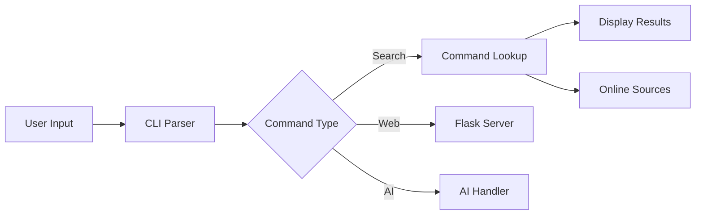

# Command Helper Implementation Details

## 📁 Project Structure

```
cmdhelper/
├── cmdhelper/                 # Main package directory
│   ├── __init__.py           # Package initialization
│   ├── cli.py                # Command-line interface
│   ├── cmdhelper.py          # Core functionality
│   ├── online_sources.py     # TLDR integration
│   ├── ai_handler.py         # AI integration (OpenAI/Local)
│   ├── data/                 # Data files
│   │   └── commands.yaml     # Command database
│   └── web/                  # Web interface
│       ├── app.py           # Flask application
│       ├── templates/       # HTML templates
│       └── static/         # CSS, JS, images
├── tests/                    # Test suite
├── docs/                     # Documentation
├── requirements.txt          # Dependencies
└── setup.py                  # Package setup
```

## 🔄 Core Components

### 1. Command-Line Interface (`cli.py`)
The entry point for the command-line tool. Handles:
- Argument parsing
- Command routing
- Interactive mode
```python
def main():
    parser = argparse.ArgumentParser()
    parser.add_argument('command', nargs='?', help='Command to search')
    parser.add_argument('--web', action='store_true', help='Start web interface')
    # ...existing argument definitions...
```

### 2. Core Logic (`cmdhelper.py`)
Contains the main functionality:
- Command searching and matching
- Example formatting
- User interaction
```python
def show_command(command):
    """Display command examples with optional online help."""
    commands = load_commands()
    if command in commands:
        # Show local examples
        display_examples(commands[command])
        # Offer online help
        online_handler.show_online_help(command)
```

### 3. Online Sources (`online_sources.py`)
Integrates with TLDR pages:
- Fetches command documentation
- Formats markdown output
- Handles network errors
```python
class OnlineSourceHandler:
    def __init__(self):
        self.tldr_url = "https://raw.githubusercontent.com/tldr-pages/tldr/main/pages/common/{}.md"
        self.timeout = 5
```

### 4. AI Integration (`ai_handler.py`)
Manages AI interactions:
- OpenAI API integration
- Local LLM support
- Command explanations
```python
class AIHandler:
    def explain_command(self, command: str) -> str:
        """Get AI explanation for a command."""
        response = self.client.chat.completions.create(
            model="gpt-3.5-turbo",
            messages=[...]
        )
```

### 5. Web Interface (`web/app.py`)
Flask-based web interface:
- Command browsing
- Search functionality
- Interactive examples
```python
@app.route('/search')
def search():
    query = request.args.get('q', '')
    results = search_commands(query)
    return render_template('search.html', results=results)
```

## 🔧 Configuration Files

### `setup.cfg` and `pyproject.toml`
Package configuration and build settings:
- Metadata
- Dependencies
- Entry points
- Development tools config

### `.pre-commit-config.yaml`
Code quality tools:
- Black (formatting)
- isort (import sorting)
- flake8 (linting)
- Pre-commit hooks

## 📊 Data Management

### `commands.yaml`
Stores command examples and descriptions:
```yaml
ls:
  - "List files in current directory::ls"
  - "List all files including hidden::ls -a"
  - "List with details::ls -l"
```

## 🔄 Component Interaction

1. **Command Flow**


2. **Data Flow**
- User enters command
- CLI parses arguments
- Local database searched
- TLDR pages checked (if requested)
- AI explanation generated (if enabled)
- Results displayed

## 🧪 Testing

### Unit Tests
Tests for each component:
- Command parsing
- TLDR integration
- AI functionality
- Web interface

### Integration Tests
Test component interaction:
- CLI to database
- Web to AI
- Search to display

## 🔒 Security

- Environment variables for API keys
- Input validation
- Rate limiting for AI calls
- Secure web interface

## 🚀 Performance

- Command caching
- Async web requests
- Efficient search algorithms
- Minimal dependencies

## 📦 Deployment

### As Python Package
```bash
pip install cmdhelper
```

### Using Docker
```bash
docker pull ghcr.io/juniort34/cmdhelper:latest
```

## 🛠️ Development Workflow

1. Setup environment:
```bash
python -m venv venv
source venv/bin/activate  # or .\venv\Scripts\activate on Windows
pip install -r requirements.txt
pre-commit install
```

2. Make changes:
- Write tests
- Implement features
- Update documentation

3. Quality checks:
```bash
pytest
black .
isort .
flake8
```

4. Build and verify:
```bash
python -m build
pip install dist/*.whl
```